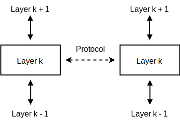
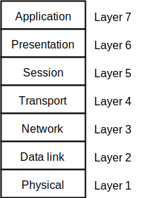
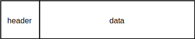

# Computer Networking

Computer networking studies how computers connect and communicate with each other. A network is essentially a group of machines that exchange information through communication links. While many networks exist, most discussions focus on the Internet because it is the largest and most widely used network.

## Network Hardware

A computer network consists of several physical components that allow machines to communicate.

Important components include:

- Host computers (end devices that send or receive data)
- Switching devices
- Communication links such as cables or wireless channels
- Supporting hardware like modems and network interface cards

Switching devices forward data across the network.

Two common types are:

- **Switches** which operate mainly within local networks
- **Routers** which forward packets across different networks

Each switching device determines the next destination for a packet. The final destination is usually a host machine.

Network nodes can generally be viewed as either:

- hosts (end systems)
- routers (forwarding devices)

Some devices may perform both roles.

### Transmission Links

Nodes communicate through links that carry signals.

Two common link types exist:

**Point-to-point links**

A direct connection between two devices.

**Broadcast links**

A shared communication channel where multiple devices receive the same transmission. Wireless networks are a typical example.

In broadcast networks every node receives the packet. Each machine checks whether the packet is addressed to it. If it is, the packet is processed. Otherwise it is ignored.

To enable communication, devices must follow agreed rules known as protocols.

## Protocols

A protocol defines how devices exchange information across a network. It specifies the structure of messages, the order of communication, and the actions taken when messages are sent or received.

Modern networking uses many protocols working together.

Organizations responsible for defining networking standards include:

- IEEE
- IETF

These organizations publish specifications that ensure interoperability between systems built by different vendors.

## Protocol Hierarchies

Network systems are usually organized into multiple layers. Each layer performs a specific function and depends on the services of the layer below it.

Data moves downward through the layers until it reaches the lowest layer where transmission occurs.

Each layer communicates with the corresponding layer on another machine. These communicating components are known as **peers**.

**Figure: Protocol peers**

Although peers appear to communicate directly, the data actually passes through each layer of the system.

Layered design makes networks flexible because one layer can be modified without affecting others as long as the interface remains unchanged.

Two important terms:

- **Network architecture**: the overall structure of layers and protocols
- **Protocol stack**: the collection of protocols implemented by a system

## The OSI Model

The OSI model is a conceptual framework that divides networking functionality into seven layers.

Each layer handles a different part of the communication process.

**Figure: The OSI model**

**Physical layer**: Handles the transmission of raw bits across a physical medium such as copper cables or optical fiber.

**Data link layer**: Ensures reliable transfer of frames across a link and detects transmission errors.

**Network layer**: Responsible for selecting routes and delivering packets across multiple networks.

**Transport layer**: Breaks large messages into smaller segments and reassembles them at the receiving side.

**Session layer**: Manages communication sessions between applications.

**Presentation layer**: Handles data representation issues such as encoding, formatting, and translation.

**Application layer**: Provides services used directly by applications such as web browsing or file transfer.

## Connection-Oriented vs Connectionless Services

Network communication can follow two different service models.

### Connection-oriented communication

Two devices first establish a connection before exchanging data. After communication finishes, the connection is closed.

This approach is similar to a phone call where a dedicated path exists during the conversation.

### Connectionless communication

Each message is sent independently and contains its own destination address.

Messages travel through the network without requiring a dedicated connection. This model is similar to sending letters through the postal system.

## Packets

Most modern networks transmit data using **packets**.

A packet is a small block of data transmitted as a single unit across the network.

Packet switching replaced traditional circuit switching because it improves reliability and resource utilization.

**Figure: Packet**

Packets typically contain two parts:

- **Header** containing control information such as addresses
- **Payload** containing the actual data

Keeping packets relatively small improves performance because large packets occupy the transmission channel for longer periods and increase retransmission cost if errors occur.

### Store-and-Forward

In many networks, switches read the entire packet before forwarding it. This process is called **store-and-forward**.

The delay introduced equals the time required to receive the whole packet.

## Routing

Routing determines how packets move from their source to their destination.

Routers maintain **forwarding tables** containing entries such as:

When a packet arrives, the router checks the destination and forwards it to the appropriate next node.

Routing tables may be:

- statically configured
- dynamically constructed using routing protocols

Smaller networks may also use a **default route** which forwards packets to a gateway if no specific match is found.

### Routing Loops

Sometimes packets circulate endlessly between routers due to incorrect routing information.

To avoid this, networks implement prevention mechanisms.

One example is the **Time To Live (TTL)** field in IP packets. Each router reduces the value by one. When the value reaches zero the packet is discarded.

### Congestion

Networks may experience congestion when too many packets arrive at a switch or router.

Routers maintain queues to buffer incoming packets. If the queue becomes full, additional packets are dropped.

Many packet losses on the Internet occur due to congestion.

## Packet Delays

Several types of delay affect packet delivery.

**Transmission delay**

Time required to push all packet bits onto the communication link.

**Propagation delay**

Time required for a signal to travel through the medium.

**Store-and-forward delay**

Time required for a switch to receive a full packet before forwarding.

**Queueing delay**

Time a packet spends waiting in a router buffer before being processed.

## Data Rate, Throughput, and Bandwidth

These terms describe network performance.

**Data rate**

The number of bits transmitted per unit time.

**Throughput**

The actual effective transmission rate after accounting for overhead and inefficiencies.

**Bandwidth**

Often used interchangeably with data rate, though it may also refer to maximum capacity of a link.

Measurements are usually expressed in bits per second, such as:

- Kb/s
- Mb/s
- Gb/s

## LANs and Ethernet

A **Local Area Network (LAN)** connects devices within a limited geographic region such as a building or campus.

A LAN typically includes:

- physical communication links
- network interface hardware
- communication protocols

**Ethernet** is the most widely used LAN technology.

Each device connected to an Ethernet network has a **Network Interface Card (NIC)** with a unique hardware address.

This address is different from an IP address because it is embedded into the network hardware.

The NIC monitors incoming traffic and processes frames that match its address.

### Broadcast Communication

Ethernet also supports a broadcast address. Frames sent to this address are delivered to every node on the network.

Broadcasting is used by protocols such as ARP which maps IP addresses to Ethernet hardware addresses.

### Ethernet Switching

Ethernet switches maintain forwarding tables that map addresses to specific ports.

These tables are learned automatically using a **passive learning** process where the switch observes incoming frames and records the associated port.

## WANs

A **Wide Area Network (WAN)** spans large geographic areas such as countries or continents.

The Internet itself is a WAN.

Another example is the cellular communication network used by mobile phones.